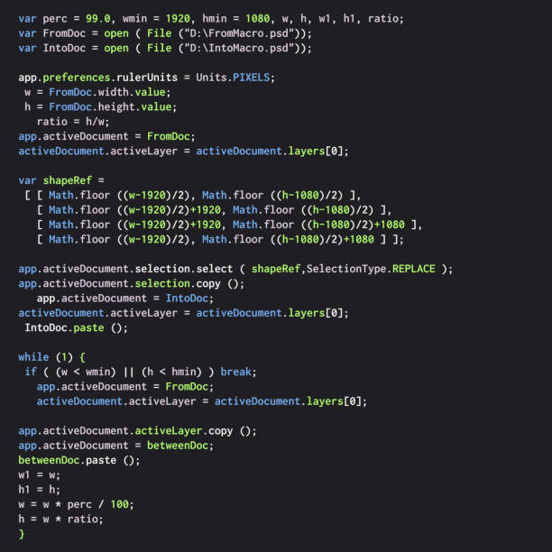

# Writing Good Documentation


## Step 1 - Using Codeblocks.

Codeblocks in markdown make it *very easy* for tech people to **copy, paste, share** code. 
A good __Cloud engineer__ uses Codeblocks whenever possible.

Because it allows others to copy and paste their code to replicate or reasearch issues.


 - In order to create codeblocks in markdown you need to use three backticks (`)
 - Not to be confused with quotation (')

```
provider "google" {
  credentials = file("path/to/your/service-account-key.json")
  project     = "your-gcp-project"
  region      = "us-central1"
}

resource "google_compute_instance" "example_instance" {
  name         = "example-instance"
  machine_type = "n1-standard-1"
  zone         = "us-central1-a"

  boot_disk {
    initialize_params {
      image = "debian-cloud/debian-9"
    }
  }

  network_interface {
    network = "default"
  }
}

end
```

- When you can you should attempt to apply syntax highlighting to your codeblocks

``` terraform
provider "google" {
  credentials = file("path/to/your/service-account-key.json")
  project     = "your-gcp-project"
  region      = "us-central1"
}

resource "google_compute_instance" "example_instance" {
  name         = "example-instance"
  machine_type = "n1-standard-1"
  zone         = "us-central1-a"

  boot_disk {
    initialize_params {
      image = "debian-cloud/debian-9"
    }
  }

  network_interface {
    network = "default"
  }
}

end
```
- Make note of where the backtick button is located.
- It should appear above the tab key, but it may vary based on your particular keyboard layout.


- Good Cloud Engineers use codeblocks for both Code and Errors that appear in the console.

``` bash
class CustomError < StandardError
  attr_reader :code

  def initialize(message, code)
    super(message)
    @code = code
  end
end

def perform_complex_operation(input)
  if input.nil?
    raise CustomError.new("Input cannot be nil.", 1001)
  elsif input.zero?
    raise CustomError.new("Input cannot be zero.", 1002)
  else
    result = 10 / input
    return result
  end
end

begin
  result = perform_complex_operation(0)
  puts "Result: #{result}"
rescue CustomError => e
  puts "Custom Error: #{e.message}, Code: #{e.code}"
rescue ZeroDivisionError => e
  puts "Zero Division Error: #{e.message}"
rescue => e
  puts "Generic Error: #{e.message}"
end
```
>Here's an example of using a codeblock for an error that appears in bash.

When you can, always provide a codeblock instead of a screnshot.
If you need to take a screenshot make sure its not a photo from your phone.

> There are certain cases where its okay to take photos with your phone. This is when you are showing something like a keyboard, which does not appear on a computer screen to be able to take screenshots.


## Step 2 - How to take screenshots

A screenshot is when you capture a part of your screen from your laptop, desktop or phone.

This is not to be confused with taking a photo with your phone:

**DON'T DO THIS**


This is what a screenshot from your computer should look like.

**DO THIS INSTEAD**



**To take screnshots with MAC OS do the following:**

- To take a screenshot, press and hold these three keys together: Shift, Command, and 3. If you see a thumbnail in the corner of your screen, click it to edit the screenshot. Or wait for the screenshot to save to your desktop.


## Step 3 - Use Github Flavoured Markdown Task Lists

Github extends Markdown to have a list where you can check off items.[<sup>[1]</sup>](#references)

- [x] Finish step 1
- [x] Finish step 2
- [x] Finish step 3
- [x] Finish step 4
- [x] Finish step 5

## Step 4 - Use Emojis (Optional)

GitHub Flavoured Markdown (GFM) supports emoji shortcodes.
Here are some examples:


| Name | Shortcode | Emoji |
| --- | --- | --- |
| Cloud | `:cloud:` | ☁️ |
| Bootcamp | `:basecamp:` | :basecamp: |

## Step 5 - How to create a table 

You can use the following format to create tables:

``` markdown
| Name | Shortcode | Emoji |
| --- | --- | --- |
| Cloud | `:cloud:` | ☁️ |
| Bootcamp | `:basecamp:` | :basecamp: |
```
Github extends the functionality of markdown tables to provide more alignment and table cell formating optioins. [<sup>[2]</sup>](#references)

- Make note of where the pipe keyboard key is located.
- It should appear above the return or enter key, but it may vary based on your particular keyboard layout.


## References

- [GitHub Flavored Markdown Spec](https://github.github.com/gfm/) 
- [Basic writing and formatting syntax](https://docs.github.com/en/get-started/writing-on-github/getting-started-with-writing-and-formatting-on-github/basic-writing-and-formatting-syntax)
- [GFM - Task Lists](https://docs.github.com/en/get-started/writing-on-github/getting-started-with-writing-and-formatting-on-github/basic-writing-and-formatting-syntax#task-lists)<sup>[1]</sup>
- [GFM - Emoji](https://github.com/ikatyang/emoji-cheat-sheet)
- [GFM - Tables (with extensions)](https://github.github.com/gfm/#tables-extension-)<sup>[2]</sup>


